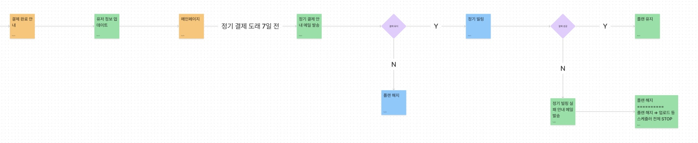
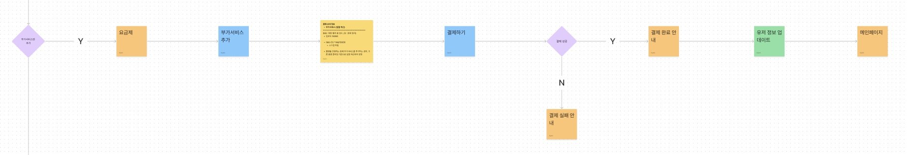
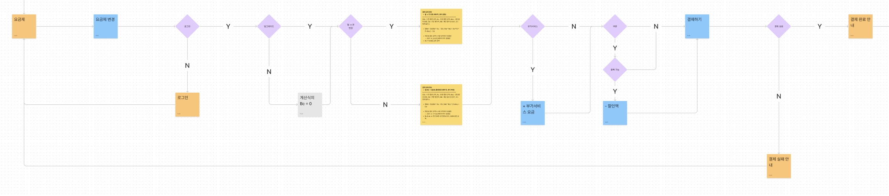

# vplate-pricing
- 기획단계에서 User flow를 적용하여 개발도 flow별 결제타입을 적용
- 각 단계별 변수를 Object로 정의하여 로직 변경시 좀더 유연하게 대응할수 있도록 적용
- 결제금액 로직을 함수로 처리하여 최종 결제 단계전 금액검증도 동일한 함수를 통하여 검증
(전체 프로젝트 중 작업한 요금제 부분만 업로드)

User flow

1. Promotion

2. 부가서비스

3. 일반요금제

